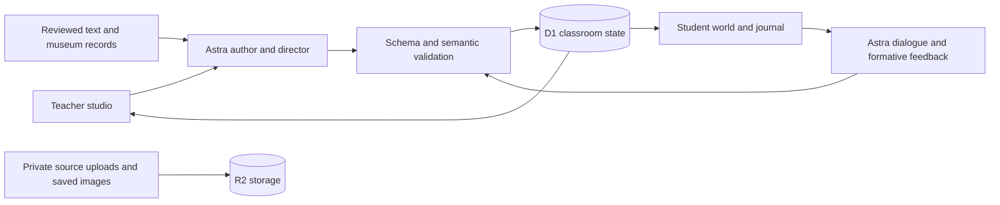

# Counterfactual Worlds

Explore a text as a 3D learning environment, examine its evidence, and revise an explanation. Teachers choose or build a lesson, invite students, and use GPT-6 Astra to respond to their reasoning and change the scene without losing their work.

**[Try the student experience](https://counterfactual-worlds-henry.handeche49.chatgpt.site/try)** · **[Explore the worlds](https://counterfactual-worlds-henry.handeche49.chatgpt.site/worlds)** · **[Browse museum objects](https://counterfactual-worlds-henry.handeche49.chatgpt.site/collections)** · **[Teacher studio](https://counterfactual-worlds-henry.handeche49.chatgpt.site/studio)**

Built for the GPT-6 Astra hackathon. This README describes the shipped application on GitHub `main`, including the September 10, 2026 version 26 release. Later development checkpoints are not automatically deployed.

## What you can use

- **10 prepared worlds and 30 lessons.** Alexandria, *The Odyssey*, *Pride and Prejudice*, *Macbeth*, *Frankenstein*, *A Christmas Carol*, *The Tempest*, the Declaration of Independence, Frederick Douglass's narrative, and Seneca Falls. Each world has three reading lessons with assigned ranges, questions, and source packets.
- **Walkable 3D scenes.** Scene-specific architecture and reading arrangements, detailed Greek and Regency companions, grounded character activity, outdoor wildlife, vegetation, water, lighting, scenic viewpoints, and optional ambient sound. Alexandria includes citizens in its work areas, responsive guide gestures, wind-driven sails and palms, and refreshed reflections. Use **Walk around**, WASD/arrows, drag to look, Shift to move faster, E to inspect, or Escape for overview. On-screen movement controls are available; sound starts off.
- **Enter Alexandria's library.** Walk through its doorway and shallow steps into a furnished reading hall with warm lighting and furniture collisions, or use the **Library reading hall** destination. Its guides wear detailed draped clothing; the setting and costumes remain interpretive reconstructions.
- **Evidence and revision.** Save a starting prediction, collect sources, select exact quotations, make a claim, receive provisional four-part feedback, and revise with a reflection. The journal keeps text, context, and citations inside the app. Draft recovery and downloads help preserve writing.
- **Source-grounded character dialogue.** Companions respond through Astra and can discuss the learner's saved explanation, feedback, and evidence. Conversations are simulated; talking does not award points, collect evidence, or unlock learning progress.
- **67 museum objects and 17 guided investigations.** Browse by book or topic, inspect attributed images, compare objects, open shareable object/pair links, and connect observations to the 30 assigned lesson ranges. Saved field notes can receive Astra image feedback that separates visible detail from interpretation.
- **Teacher tools.** A saved-world library, textbook/excerpt builder, invitations, live learner activity, individual learning reports, and printable teaching guides and worksheets. Teachers can prepare help from a selected learner's saved work and review it before sharing with the class.
- **Astra scene direction.** Preview and apply changes to lighting, haze, water conditions, and viewpoints across the reading worlds. Alexandria also supports bounded what-if changes to ship, market, and crowd activity. Teacher undo/reset controls preserve sources and student work.

### How a class works

1. The teacher selects a prepared lesson or reviews one built from source material, introduces its question, and shares the classroom invitation.
2. Students record an initial prediction, explore the assigned places, read sources, and collect quotations or museum observations.
3. Students explain their reasoning. Astra provides formative feedback; the teacher uses the learning report to identify missing evidence or unsupported assumptions.
4. The teacher can share a challenge or a reviewed scene edit. Students return to the evidence, revise their argument, and explain what changed their thinking.

Classrooms support multiple students with separate saved state and access tokens. Clients refresh classroom state after each request and poll approximately every 2.5 seconds. This is shared classroom activity, not multiplayer avatar-position synchronization. A separate WebSocket connection supports mid-response steering of Astra's teacher director; a standard request path is also available.

## Access and pilot limits

`/worlds` and `/collections` are public browsing routes. `/try` creates an isolated **learner-only** trial when needed and restores it in the same browser. It does not provide teacher credentials or invitation privileges. `/studio` requires the private teacher access code; classroom invitations give students access to their assigned room.

AI calls require server-side credentials and an available pilot allowance. The current policy includes a configurable shared request cap and six AI reservations per classroom, shared by teacher and students. A steering correction consumes another reservation. When AI is paused or the allowance is exhausted, users can still explore, read, and keep writing. See [the policy implementation](lib/pilotPolicy.ts) and [quota enforcement](lib/pilot.ts).

Character conversations offer **Generate portrait** on request. Portraits use a separate lifetime allowance: currently 20 attempts across the public pilot and three per classroom, independent of the text allowance of 30 shared requests and six per classroom. Failed upstream attempts count; cached portraits are reused without another generation charge. Portraits are stored privately and labeled as AI-generated interpretations.

New setting-image generation remains disabled. Existing saved illustrations remain readable, and curated museum images still support visual analysis. An illustration or reconstructed scene is an interpretation, not source evidence.

## Run locally

Use **Node 24**; `.tool-versions` pins `24.13.0`. The app uses React, TypeScript, Three.js, vinext/Vite, and local Cloudflare D1/R2 emulation.

```sh
git clone https://github.com/henryhehehe/GPT6-hack.git
cd GPT6-hack
npm run install:ci
cp .env.example .env.local
mkdir -p .openai
```

Edit `.env.local` with your own values. Set the AI allowance to `0` for a local run without paid model calls; choose a positive allowance only when you intend to exercise live Astra features.

```dotenv
OPENAI_API_KEY=your-server-side-api-key
OPENAI_MODEL=gpt-6-astra
PILOT_TEACHER_CODE=choose-a-private-local-code
PILOT_AI_REQUEST_LIMIT=0
PILOT_PORTRAIT_REQUEST_LIMIT=0
```

The checked-in `.env.example` supplies the API settings and disables new portraits by default; add the teacher code and text-AI allowance shown above. The teacher code is required for local studio access. Set `PILOT_PORTRAIT_REQUEST_LIMIT` to a positive value only when you intend to generate paid portraits. Both allowances are request counts, not dollar budgets, and persist in the local database.

The deployment-specific `.openai/hosting.json` is intentionally ignored by Git, but the Vite configuration imports it. **For a fresh clone**, create `.openai/hosting.json` with these local bindings. Preserve an existing file if the checkout is already configured for Sites.

```json
{
  "d1": "DB",
  "r2": "BUCKET"
}
```

Then build and initialize the local database:

```sh
cp .env.local .dev.vars
npm run build

# Run once for a new local database, in filename order.
for migration in drizzle/[0-9]*.sql; do
  node --import ./scripts/sites-env.mjs ./node_modules/wrangler/bin/wrangler.js d1 execute DB --local --config dist/server/wrangler.json --persist-to .wrangler/state --file "$migration"
done

npm run dev
```

Open `http://localhost:5173`. Use `/try` for a student trial or `/studio` with the local teacher code. Do not reapply the SQL files to an already initialized database; apply only new migrations. After changing runtime values, update `.dev.vars` and restart the server. Environment files, teacher codes, invitation credentials, and local database state must stay out of Git.

`npm start` runs the built app through a local Wrangler preview; it is not a standalone production Node server. Hosted settings and resources are configured through Sites, separately from local files.

## Build a lesson from a book or upload

In **Teacher studio → Build from source material**, choose a prepared lesson, paste text, upload a PDF/TXT/Markdown excerpt, or enter a direct public HTTPS PDF URL. Supply the reading range and an optional learning objective. Astra prepares places, characters, activities, evidence, and an inquiry. Review the source quotations and locators, then launch a classroom and preview the student experience before inviting students.

Uploads are limited to 5 MB and source text to 60,000 characters. With no reading range, PDF extraction is instructed to use the first ten PDF pages. Supply the intended excerpt rather than expecting an entire textbook to be exhaustively transformed in one run. PDF extraction, especially from scans or unusual layouts, needs teacher verification.

Custom lessons use reusable coast, garden, or archive settings. Astra generates validated lesson data; it does not generate arbitrary executable geometry or an accurate architectural replica. Uploaded originals remain private, while reviewed excerpts become the classroom's cited evidence.

A real public-domain upload fixture is included: [Pride and Prejudice, Chapter III (PDF)](public/samples/pride-and-prejudice-chapter-3.pdf). Use PDF pages 1–4. See [the upload guide and text alternative](output/pdf/UPLOAD-GUIDE.md).

## Architecture and model use



Astra is used for source extraction, lesson authoring, character dialogue, argument feedback, museum-image critique, and teacher interventions. Structured outputs are validated before being stored or applied. Scene controls operate within explicit schemas; the model cannot rewrite reviewed sources, award progress through dialogue, or execute arbitrary generated code.

The server owns classroom and student state. Version/revision checks reject stale writes, request IDs make supported retries idempotent, and learner responses omit private teacher context and other students' work. Keys remain server-side. Browser storage holds device-local drafts, preferences, and access needed to resume a session.

## Models and provenance

The scene combines original Blender-authored assets with licensed external models. The in-app `/model-catalog` provides previews, animation controls, downloads, and provenance. See:

- [Blender sources and regeneration](assets/blender/README.md)
- [External model library](assets/external/README.md) and [per-model usage guide](assets/external/USAGE-GUIDE.md)
- [Character catalog and usage](assets/CHARACTER-USAGE-GUIDE.md)
- [Museum object sources and editorial boundaries](docs/MUSEUM-OBJECT-EXPANSION.md)
- [Landscape art direction](docs/LANDSCAPE-ART-DIRECTION.md) and [lighting/composition review](docs/curriculum/LIGHTING-AND-MOTION-REVIEW.md)
- [Alexandria scene review](docs/ALEXANDRIA-SCENE-REVIEW.md) and [character activity and wildlife review](docs/SCENE-LIFE-REVIEW.md)
- [Enterable library](docs/ALEXANDRIA-INTERIOR.md) and [Alexandria clothing](docs/ALEXANDRIA-CLOTHING.md)

Museum attribution and license information stays with each object. Later depictions, reconstructions, costumes, and hypothetical causal links are distinguished from evidence in the assigned text.

## Validation

For offline checks:

```sh
npm test
npx tsc --noEmit
npm run build
node --import tsx scripts/check-review-learning.mjs
node --import tsx scripts/check-pilot-reservation-order.mjs
node --import tsx scripts/check-release-privacy-recovery.mjs
node scripts/check-public-portraits.mjs
```

The last four commands exercise the actual built Worker with temporary local storage, dummy credentials, and intercepted API requests. They cover learning/citations, quota behavior, learner privacy, draft recovery, scene undo/reset, the first-visit learning form, and portrait authorization/caching/limits without paid model calls.

The version 26 release passed **328 tests**, TypeScript, its production build, Alexandria asset validation, and built-Worker checks for portraits, privacy, and recovery. Browser review entered the library reading hall and checked its doorway and warm lighting; earlier release checks also covered quotas, book filters, paired-object investigations, share links, and first-visit prediction persistence. Live portrait generation consumes its allowance; offline checks do not. These are engineering checks, not proof of educational effectiveness. Later checkpoints should report their own results.

Other scripts under `scripts/smoke-*.mjs` target a running app and may create classrooms or consume quota. Review each script before running it. Live authoring, steering, dialogue, feedback, and probes use the configured API and incur usage. Gated smoke checks accept `PILOT_TEST_TEACHER_CODE` through the process environment; never put a real code in documentation or a committed command.

## Deployment and project notes

GitHub pushes and local changes do not automatically deploy. Follow [the deployment runbook](docs/DEPLOYMENT.md) to select a verified checkpoint, preserve published functionality and access policy, and publish through the existing Sites project. Never copy local runtime credentials or private submission notes into public source history.

Useful background:

- [Independent review context](docs/REVIEW-CONTEXT.md)
- [Learning UX research](docs/LEARNING-UX-RESEARCH.md)
- [Curriculum teaching packs](docs/curriculum/)
- [Astra learning and scene-edit contracts](docs/ASTRA-LEARNING-UPGRADE.md)
- [Museum teaching guide](docs/MUSEUM-INVESTIGATION-GUIDE.md)
- [Business validity review](docs/BUSINESS-VALIDITY-REVIEW.md)

The original `counterfactual-worlds-handoff/` materials and older build logs are design history; their planned features, interface descriptions, and test counts may be superseded by the current code. The demo uses real teacher and student interactions; prepared material and edited waiting time should be identified honestly.

## Limits

This is a public pilot, not a production school identity or student-information system. Teacher access uses a private code and classroom tokens; broader rollout needs stronger identity management, accessibility/performance evaluation, and classroom research. Scenes and costumes are interpretive, not verified historical reconstructions. AI feedback can be wrong and remains formative, not a validated grade or demonstrated learning gain.
