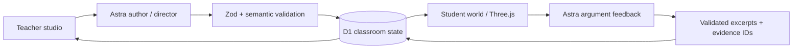

# Counterfactual Worlds

A teacher shapes a historical thought experiment. A student explores a living 3D harbor, examines evidence, and defends a causal explanation. The teacher can add help to the running world without losing the student's work.

Built for the GPT-6 Astra hackathon. The one-minute video uses **both interfaces**: teacher → student → teacher intervention → student revision.

Next sprint: [parallel implementation plan](docs/PARALLEL-IMPLEMENTATION-PLAN.md), with three agent tracks, exclusive file ownership, integration contracts, priorities, and acceptance checks.

## Run locally

Requires Node 24 (the repository includes `.tool-versions`).

```sh
npm install
cp .env.example .env.local
# Add OPENAI_API_KEY to .env.local, then:
cp .env.local .dev.vars
npm run build
node --import ./scripts/sites-env.mjs ./node_modules/wrangler/bin/wrangler.js d1 execute DB --local --config dist/server/wrangler.json --persist-to .wrangler/state --file drizzle/0000_common_dreadnoughts.sql
npm run dev
```

Apply that local database migration once, not on every launch. The server prints the preview URL, normally http://localhost:5173. Do not commit environment files. Hosted deployments use a secret configured in Sites rather than these local files.

The first page opens the teacher studio with a prepared lesson. “Generate with Astra” creates a live, schema-validated lesson. “Preview as student” opens the connected student view. “Invite students” copies a tokenized invitation for a separate browser. Treat teacher credentials as private. The browser stores access tokens locally; the server stores authoritative classroom and student state in D1.

## What works

- Teacher source editor, structural intervention, Astra authoring, student invitations, live student activity, and intervention preview/application.
- Three.js harbor district with library, market, docks, moving ships, water, citizens, evidence markers, camera focus, and visible scenario changes.
- Student evidence inventory, merchant/archivist dialogue, four-part argument rubric, and archive unlock.
- Native Astra mid-turn steering over WebSocket. A standard request remains available when the transport is unavailable; it is labeled separately.
- Persistent classroom state and student isolation. Clients poll every 2.5 seconds; no synthetic classroom counts.
- Provenance labels for historical sources, explicit assumptions, and invented teaching props.
- WebMCP tools for inspecting places, collecting evidence, and reading displayed state.

## Architecture



Astra generates declarative lesson data, causal explanations, visual activity parameters, NPC feedback, and teaching interventions. The renderer uses authored, bounded architecture templates; it does not execute arbitrary model-generated code. World versions and per-student revisions reject stale writes. Patches preserve student progress; duplicate patch IDs are idempotent. API keys remain server-side.

## Checks and development evidence

```sh
npm test
npx tsc --noEmit
npm run build
node scripts/smoke.mjs
node scripts/smoke.mjs --live
node scripts/smoke-steering.mjs
node scripts/smoke-author.mjs
```

The `--live`, steering, authoring, and probe scripts make paid Astra requests. Smoke scripts create test classrooms and save access credentials under ignored `artifacts/private/`. `smoke-steering.mjs` uses the classroom created by `smoke.mjs`.

Seven deterministic tests cover dangling/duplicate references, unavailable evidence, fabricated excerpts, and progression requirements. Live smoke checks verified a rejected instruction attack, a supported argument, classroom state preservation, and a native steering correction. See [build evidence](docs/BUILD-LOG.md) for actual response IDs and timings. These are small smoke tests, not educational validation or statistical latency claims.

## One-minute video

See [the 60-second storyboard](counterfactual-worlds-handoff/05-one-minute-demo.md). Record real interactions, then edit waits transparently. Prepared lessons and earlier generated results are labeled. No canned NPC answer is substituted on an API failure.

Suggested sequence: teacher selects a cause → student watches the world change → student submits a weak argument → teacher creates and steers a hint → student uses evidence to revise → archive opens. Put development/engineering detail in the submission text.

## Sources and limits

Historical context is a short paraphrase of [Strabo, Geography 17.1.8](https://penelope.uchicago.edu/Thayer/E/Roman/Texts/Strabo/17A1*.html), public-domain translation hosted by the University of Chicago. It describes institutional support around the Museum; it does not establish a precise library budget or prove trade was its only support.

Architecture is illustrative. Ship counts and funding links are explicitly hypothetical. The app explores possible consequences under assumptions, not verified alternate history. The model can still misjudge arguments; this is formative feedback, not a validated assessment or evidence of learning gains. The authoring runtime is deliberately limited to harbor/market/library lessons. Historical source cards are locked to reviewed text; arbitrary new historical sourcing is not automated.

The application currently uses bearer classroom/invitation tokens and is intended for a private hackathon demonstration. A classroom-scale release needs identity management, teacher-reviewed lesson packs, stronger quota controls, fuller rubric evaluation, and accessibility/performance testing. Private Sites hosting requires the owner to sign in; an invitation does not bypass hosting access restrictions.

Original concept materials remain in `counterfactual-worlds-handoff/`; the reviewed plan supersedes their conflicting claims and the one-minute storyboard supersedes the three-minute script. The original prototype is reference material and uses an optional Claude interface; the new application explicitly calls Astra.
