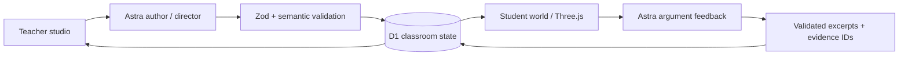

# Counterfactual Worlds

A teacher shapes a historical thought experiment. A student explores a living 3D harbor, examines evidence, and defends a causal explanation. The teacher can add help to the running world without losing the student's work.

Built for the GPT-6 Astra hackathon. The one-minute video uses **both interfaces**: teacher → student → teacher intervention → student revision.

Next sprint: [parallel implementation plan](docs/PARALLEL-IMPLEMENTATION-PLAN.md), with three agent tracks, exclusive file ownership, integration contracts, priorities, and acceptance checks.

Product scope also includes English: [The Odyssey and Pride and Prejudice expansion](docs/LITERATURE-EXPANSION.md). Those literature packs are planned; the current runtime remains the Alexandria lesson.

For independent review, pass along [the one-page context brief](docs/REVIEW-CONTEXT.md). [Learning UX research](docs/LEARNING-UX-RESEARCH.md) compares five products and separates documented patterns from design recommendations.

The [external model library](assets/external/README.md) stores eight downloaded CC0 collections, 69 selected 3D source assets, and twelve prepared GLB examples for later integration, with licenses, checksums, measurements and previews. The [open-model shortlist](docs/OPEN-MODEL-SHORTLIST.md) preserves additional candidates and acquisition limits. These downloads are staged offline and are not yet part of the running scenes.

Students can now talk to Dorian at the harbor, Thaleia at the market, and Ione near the library. Click a character or their name in the scene, or use **Talk to someone**. Astra generates source-grounded text replies and follow-ups; conversations persist per learner, character, and viewed scenario. Supporting material opens inside the source reader. Dialogue is explicitly simulated and cannot award points, collect evidence, or unlock the archive; **Make your case** remains the separate assessment flow. This release does not add voice or animated lip-sync.

Run `node scripts/smoke-dialogue.mjs` for request-boundary checks, or add `--live` for three real Astra turns (uses the configured API key and incurs API usage). `APP_URL` can select the target environment. The script creates an isolated test classroom and does not print access credentials.

## Run locally

Requires Node 24 (the repository includes `.tool-versions`).

```sh
npm install
cp .env.example .env.local
# Add OPENAI_API_KEY to .env.local, then:
cp .env.local .dev.vars
npm run build
node --import ./scripts/sites-env.mjs ./node_modules/wrangler/bin/wrangler.js d1 execute DB --local --config dist/server/wrangler.json --persist-to .wrangler/state --file drizzle/0000_common_dreadnoughts.sql
node --import ./scripts/sites-env.mjs ./node_modules/wrangler/bin/wrangler.js d1 execute DB --local --config dist/server/wrangler.json --persist-to .wrangler/state --file drizzle/0001_fearless_whiplash.sql
npm run dev
```

Apply each local database migration once, not on every launch. The server prints the preview URL, normally http://localhost:5173. Do not commit environment files. Hosted deployments use a secret configured in Sites rather than these local files.

### Build from a textbook or reading

In **Teacher studio → Build from source material**, enter a source title and paste a passage, upload a PDF/TXT/Markdown excerpt, or supply a direct public HTTPS PDF link. Add a reading range and optional objective. Astra prepares places, characters, activities, evidence, and a what-if investigation. Check the quotations and locators in the review screen, then **Launch new classroom**. Preview as a student before sharing its invitation. Existing student work is preserved in the previous classroom.

PDFs are limited to 5 MB; text to 60,000 characters. A PDF with no range uses its first ten pages. For pasted or text-file material, supply only the intended excerpt. A whole textbook is not exhaustively transformed in one run. PDF extraction needs teacher verification, especially scans and unusual layouts. Generated scenes use symbolic coast, garden, or archive templates; they are not automatic architectural replicas. Sources are stored privately, while approved excerpts appear directly in the student journal with citations. Teacher source access survives launch and refresh.

Validation: `npm test` and `node scripts/smoke-builder.mjs`; append `--live` for paid Astra generation, dialogue, PDF extraction, launch/retry, and private source tests.

The first page opens the teacher studio with a prepared lesson. “Generate with Astra” creates a live, schema-validated lesson. “Preview as student” opens the connected student view. “Invite students” copies a tokenized invitation for a separate browser. Treat teacher credentials as private. The browser stores access tokens locally; the server stores authoritative classroom and student state in D1.

## What works

- Teacher source editor, structural intervention, Astra authoring, student invitations, live student activity, and intervention preview/application.
- Three.js harbor district with library, market, docks, moving ships, water, citizens, evidence markers, camera focus, and visible scenario changes.
- Original Blender-authored library and lighthouse assets, loaded as GLB with a playable fallback and independently animated archive doors. Editable source and regeneration instructions live in [assets/blender](assets/blender/README.md).
- Ground-level exploration: choose **Walk around**, use WASD/arrows to move, drag to look, Shift for faster movement, E to inspect a nearby place, or Escape for overview. Touch movement/turn controls and location shortcuts remain available. Outdoor streets, stairs, and piers are walkable; building interiors are not yet navigable.
- A viewport-filling student world with an on-demand journal and argument panel. The in-app reader contains text, source context, citation insertion, and an attributed setting illustration; students can reopen sources while drafting. The illustration is explicitly separate from historical evidence.
- Student evidence inventory, merchant/archivist dialogue, four-part argument rubric, and archive unlock.
- Native Astra mid-turn steering over WebSocket. A standard request remains available when the transport is unavailable; it is labeled separately.
- Persistent classroom state and student isolation. Clients poll every 2.5 seconds; no synthetic classroom counts.
- Provenance labels for historical sources, explicit assumptions, and invented teaching props.
- WebMCP tools for inspecting places, collecting evidence, and reading displayed state.

## Architecture



Astra generates declarative lesson data, causal explanations, visual activity parameters, NPC feedback, and teaching interventions. The renderer uses authored, bounded architecture templates; it does not execute arbitrary model-generated code. World versions and per-student revisions reject stale writes. Patches preserve student progress; duplicate patch IDs are idempotent. API keys remain server-side.

## Checks and development evidence

```sh
npm test
npx tsc --noEmit
npm run build
node scripts/smoke.mjs
node scripts/smoke.mjs --live
node scripts/smoke-steering.mjs
node scripts/smoke-author.mjs
```

The `--live`, steering, authoring, and probe scripts make paid Astra requests. Smoke scripts create test classrooms and save access credentials under ignored `artifacts/private/`. `smoke-steering.mjs` uses the classroom created by `smoke.mjs`.

Seven deterministic tests cover dangling/duplicate references, unavailable evidence, fabricated excerpts, and progression requirements. Live smoke checks verified a rejected instruction attack, a supported argument, classroom state preservation, and a native steering correction. See [build evidence](docs/BUILD-LOG.md) for actual response IDs and timings. These are small smoke tests, not educational validation or statistical latency claims.

Thirteen additional movement/controller tests cover connected routes, dock/shore boundaries, wall sliding, stairs, movement speed, focus-scoped keys, blur/release handling, and camera restoration. These are offline checks; a browser usability/playtest is still needed before recording.

## One-minute video

See [the 60-second storyboard](counterfactual-worlds-handoff/05-one-minute-demo.md). Record real interactions, then edit waits transparently. Prepared lessons and earlier generated results are labeled. No canned NPC answer is substituted on an API failure.

Suggested sequence: teacher selects a cause → student watches the world change → student submits a weak argument → teacher creates and steers a hint → student uses evidence to revise → archive opens. Put development/engineering detail in the submission text.

## Sources and limits

Historical context is a short paraphrase of [Strabo, Geography 17.1.8](https://penelope.uchicago.edu/Thayer/E/Roman/Texts/Strabo/17A1*.html), public-domain translation hosted by the University of Chicago. It describes institutional support around the Museum; it does not establish a precise library budget or prove trade was its only support.

Architecture is illustrative. Ship counts and funding links are explicitly hypothetical. The app explores possible consequences under assumptions, not verified alternate history. The model can still misjudge arguments; this is formative feedback, not a validated assessment or evidence of learning gains. The authoring runtime is deliberately limited to harbor/market/library lessons. Historical source cards are locked to reviewed text; arbitrary new historical sourcing is not automated.

The application currently uses bearer classroom/invitation tokens and is intended for a private hackathon demonstration. A classroom-scale release needs identity management, teacher-reviewed lesson packs, stronger quota controls, fuller rubric evaluation, and accessibility/performance testing. Private Sites hosting requires the owner to sign in; an invitation does not bypass hosting access restrictions.

Original concept materials remain in `counterfactual-worlds-handoff/`; the reviewed plan supersedes their conflicting claims and the one-minute storyboard supersedes the three-minute script. The original prototype is reference material and uses an optional Claude interface; the new application explicitly calls Astra.

### Book-specific setting illustrations

Lesson preparation now asks GPT-6 Astra to direct its `image_generation` tool after the evidence-grounded lesson is saved. The image tool defaults to `gpt-image-2.5-flare`, using the existing server API key; `OPENAI_IMAGE_MODEL` may override that tool model. Generated PNGs remain private in R2. The teacher reviews the exact image revision before launch; students can switch between the illustrated setting and the walkable learning view and inspect the image in the source reader. Illustrations depict the baseline and are labeled interpretations, never source evidence. Image errors preserve the lesson and allow a retry or image-less launch. Successful images are reused, not regenerated on refresh.

A real upload fixture is included at `public/samples/pride-and-prejudice-chapter-3.pdf`, downloadable inside the builder. It contains Jane Austen's complete Chapter III, reformatted from the public-domain Project Gutenberg edition, plus a clearly separated editorial note. Select PDF pages 1–4. A TXT alternative and upload guide are under `output/pdf/`. The complete illustrated source edition is https://www.gutenberg.org/ebooks/1342.

Run `node scripts/smoke-book-images.mjs --images` for a paid end-to-end check of the real PDF, lesson generation, illustration, cached replay, and teacher/student image access. Use `--resume --images` to retry the saved private test draft without repeating PDF extraction.

## Teaching kit and buyer review

In the teacher studio, open **Teaching guide & worksheet** for a 30-, 45-, or 60-minute sequence and a downloadable source packet with a student worksheet. The self-contained HTML download can be opened offline and printed or saved as PDF; paper answers do not sync automatically. **Learning report** compares first/latest explanations and exports every submitted turn, excluding the teacher preview. AI feedback remains provisional; repeated or changed wording is not evidence of learning gains.

The [business validity review](docs/BUSINESS-VALIDITY-REVIEW.md) covers the initial buyer, competitor alternatives, school-readiness gaps, proposed pricing experiments, cost sensitivity, and a four-week customer-validation plan. Pricing and pilot targets are hypotheses, not offers or observed results.
