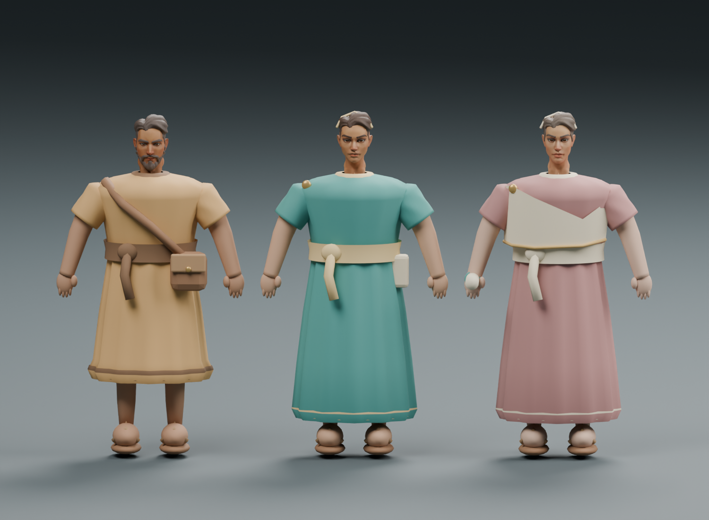
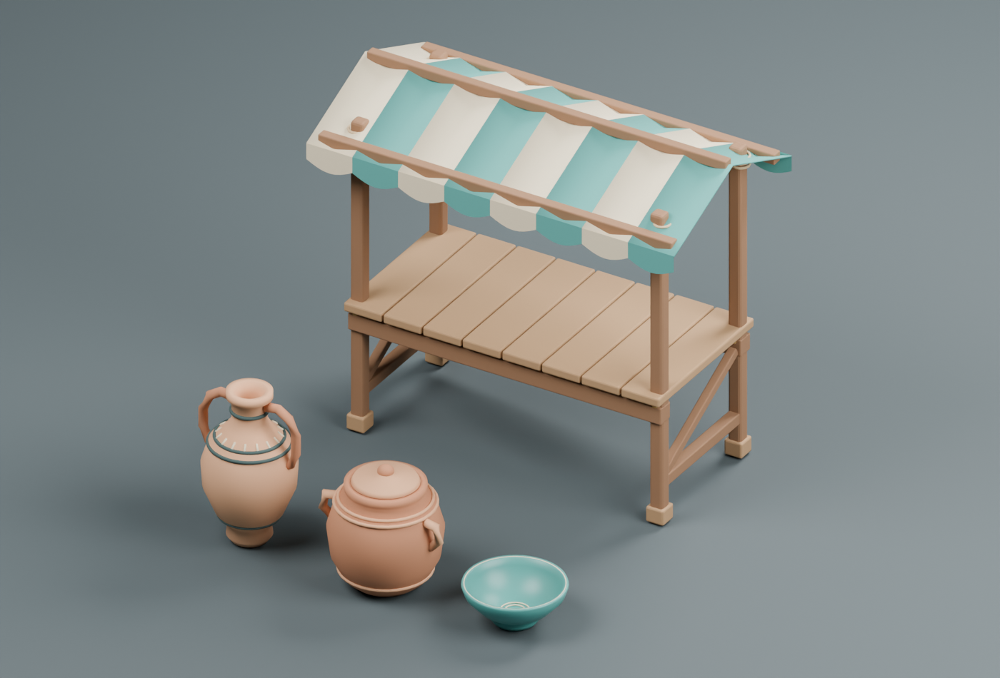
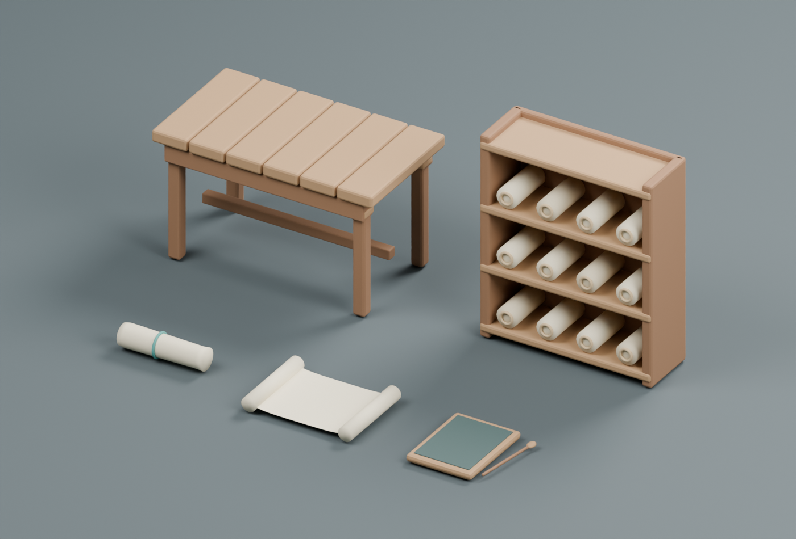
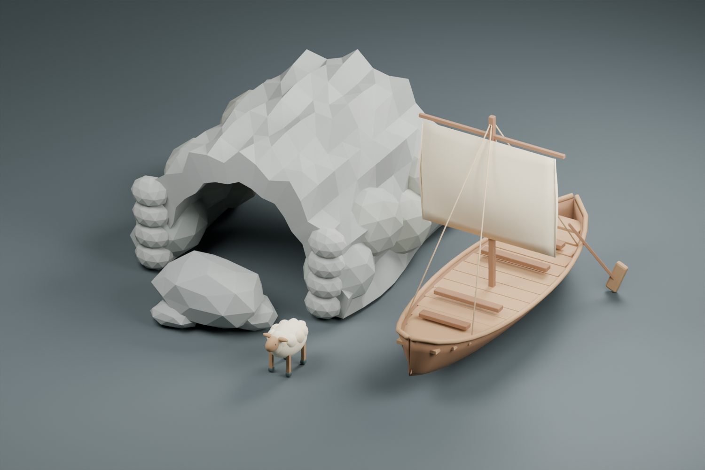
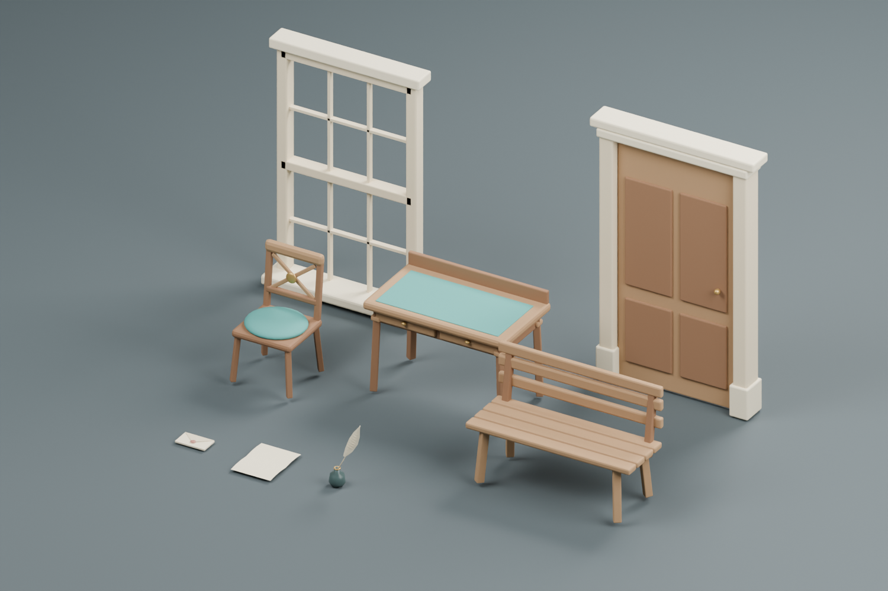

# Counterfactual Worlds model kit

Original editable models for everyday objects, teaching characters, and illustrative literature settings. All assets in `model-manifest.json` were created for this project and use the repository MIT license. Existing asset collections elsewhere in this repository are separate from this inventory.

## Open the collection

- [Blender sources and PNG previews](blender/MODELING.md)
- [Runtime prop GLBs](../public/models/props/)
- [Runtime character GLBs](../public/models/characters/)
- [Asset inventory, bounds, anchors, rights, and checksums](model-manifest.json)
- [Measured model sizes and geometry](model-metrics.json)
- [Verification record](../docs/MODEL-QA.md)

Run `node scripts/serve-model-viewer.mjs` from the repository root and open [the local model studio](http://127.0.0.1:5198). Select a model, orbit/zoom, change its view, download the GLB, or play one of the hero character's animation clips. This is a local asset inspection tool, separate from the student application.

| Collection | Contents | Editable scene |
| --- | --- | --- |
| Market | Amphora, storage jar, bowl, striped stall | [market.blend](blender/props/market.blend) |
| Cargo | Crate, sack, basket, rope coil | [cargo.blend](blender/props/cargo.blend) |
| Archive | Rolled/open scroll, tablet/stylus, reading table, scroll rack | [archive.blend](blender/props/archive.blend) |
| Hero characters | Thaleia, Dorian, Ione; shared skeleton; Idle/Greeting/Talk | [alexandria-cast.blend](blender/characters/alexandria-cast.blend) |
| Background figures | Four static color variants with reduced geometry | [background-citizens.blend](blender/characters/background-citizens.blend) |
| Odyssey scenery | Coast rocks, cave, merchant ship, sheep | [odyssey.blend](blender/props/odyssey.blend) |
| Austen objects | Letters, quill/inkwell, chair, desk, bench, window, doorway | [austen.blend](blender/props/austen.blend) |
| Room/garden modules | Paneled wall and paving | [austen-architecture.blend](blender/props/austen-architecture.blend) |

## Scene integration handoff

The GLBs are ready to load; this asset-production change does not replace meshes in the live classroom. The current checkout also contains separate in-progress scene work. Integrate through that scene owner to preserve their edits and avoid rendering duplicate asset kits.

1. Load a registered local `url` from the manifest with Three.js `GLTFLoader`. The files contain their own geometry and vertex-color materials; there are no texture/decoder downloads. Preserve the existing procedural fallback until loading succeeds. Do not apply a new global color material, which would erase the authored palettes.
2. Use the model at scale 1 initially. Exports use Y-up, front +Z, and a ground-level origin. The `.blend` gallery positions are not embedded in the GLBs. Measure the resulting scene placement beside the actual walking camera before multiplying instances.
3. Bind `dorian` to the existing harbor character, `thaleia` to market, and `ione` to library. Propagate the existing character/zone identifiers onto pickable descendants; update labels from the named `Anchor_Label` world position. Preserve each character's identity, conversation state, accessible directory entry, and simulated-dialogue label.
4. Use `SkeletonUtils.clone` when duplicating a rigged character. Use an `AnimationMixer` per independently animated instance, and update it with a bounded delta. `Idle`, `Greeting`, and `Talk` are exact clip names. The low-detail citizens have no clips or dialogue anchors. Reduced motion should retain a stable pose.
5. Props expose `<asset-id>__Anchor_Inspect`. Map the prop instance to an actual reviewed source/activity in the selected lesson; the shared GLB contains no source IDs. Opening a scroll/letter must display the real accessible source reader. Objects and characters remain interpretive or simulated.
6. Separate harbor cargo, market stock, and library props into their own activity groups. Permanent teaching characters should remain available when a hypothetical scenario hides stock or background activity. Geometry never awards scores or unlocks.
7. The cave exposes `cave-module__Anchor_Entrance` and `cave-module__Anchor_Exit`; its floor and collision still need scene authoring. The Austen doorway exposes `austen-doorway__DoorHinge`, which rotates about local Y in Three.js. Do not merge the movable leaf into the static jamb. Keep the older library's `ArchiveDoorLeft` / `ArchiveDoorRight` unchanged.
8. Derive simple collision bounds from the inventory and author clear passage volumes explicitly. A visible doorway/cave must agree with navigation and application wording. The garden path is a mesh module, not a navigation system.
9. On scene teardown, stop mixers, remove loaded roots, and dispose geometry/material resources only when no other instance owns them. Dispose late-arriving loads after unmount. Keep source and character access available if loading or WebGL fails.
10. Recheck the same walking route on the target device after integration. The manifest lists all kits for inspection; load only the assets needed by the lesson. The full archive is not an instruction to preload every book's scenery.

Book-specific source packs, character identities, spoiler boundaries, traversal, and literature teaching activities remain product work. The scene modules do not assert that native Odyssey or Austen lessons are implemented. Fully rigged mythic characters, combat, lip sync, and cinematic animation remain deferred as in the work plan.

## Preview sheets

