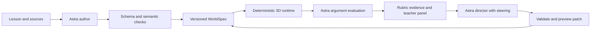

# Counterfactual Worlds: solo hackathon plan

Reviewed September 10, 2026, around 11:00 EDT. Solo builder; Astra API access confirmed by builder. This is a plan, not a built or benchmarked application. The 22:00 deadline and code-reuse rules come from the original handoff and should be checked against the organizer briefing. Judging weights come from the user's problem statement.

## Recommendation

Keep the idea. Focus on **a playable argument that a teacher can redirect live**.

Pitch: **“Change one cause. Explore what follows. Defend what you believe.”**

A teacher turns a short source packet into a compact historical scenario. A student changes one structural variable, examines the consequences, and argues with two characters using evidence. When the student struggles, the teacher changes the explanation inside the running world. The student succeeds through supported reasoning, including defensible disagreement.

The strongest differentiator is the relationship between the world, the argument, and the teacher intervention. A larger map and thirty personalized introductions will not prove that relationship better. The real-world entry point is a 10–15 minute history-class activity, with a teacher view of the student's claim, evidence, missing reasoning, and revision. Classroom usefulness is a hypothesis to test, not a demonstrated learning gain.

The user explicitly welcomes a better Three.js experience than the handoff. The old prototype is a concept reference, not the design target. Keep the number of systems small while making the scene composition, animation, and interaction substantially more ambitious.

## Review of the handoff

All four original files were inspected. Both HTML files were opened in a browser and the prototype was entered; its full gameplay was not tested.

| Finding | Decision |
|---|---|
| Strong low-poly visual language, amber differences, argumentative NPCs | Keep these; frame the opening camera on the harbor and first NPC |
| Schedule assumes four people and several product surfaces | One lesson, two NPCs, one counterfactual, one teacher intervention |
| Prototype uses `window.claude.use('sample')` with `modelTier: 'quick'` | Replace with an explicit server-side Astra integration; retain actual response IDs |
| Four bespoke site builders, no WorldSpec loader | Rebuild a small runtime driven by declarative data |
| Keyword scoring rewards vocabulary and prescribed agreement | Evaluate evidence and mechanism; accept supported disagreement |
| “Not found” objects are treated as decisive proof of absent institutions | Separate observation, interpretation, and hypothetical prediction |
| Alexandria, Before Kings, and Vienna compete as demo lessons | Choose one Alexandria-inspired harbor lesson; defer the rest |
| “Director is the only live call” conflicts with live NPC dialogue | Cache world construction; keep arguments and interventions live |
| Spec lacks evidence records, stable IDs, source references, and versions | Define these before implementation |
| Both HTML files lack charset declarations and display broken punctuation | New app must declare UTF-8; retain the old files as references |
| Prototype opens on mostly empty terrain; panels overlap at the inspected viewport | Compact camera framing, quick travel, and responsive evidence drawer |

The original archaeological assertions, learning-effect statistics, and third-party model-performance claims were not independently verified in this review. Do not repeat them as validated facts about this product. In particular, NPC dialogue and fabricated ledgers cannot become historical evidence merely because the model generated them.

## Compete across all four judging categories

These are deliverables, not predicted scores or a guarantee of winning.

| Criterion | What judges should see | Proof to retain |
|---|---|---|
| Astra in development — 25% | Model-assisted contract design, implementation, browser inspection, and repair of a real bug | Build log linking actual prompts/tasks, commits, screenshots, and relevant checks |
| Astra in project — 25% | Source interpretation, consistent scenario changes, unfamiliar argument evaluation, and teacher steering | Model/response IDs, structured outputs, steering trace |
| Live demo — 25% | A visible causal change, fair argument exchange, and teacher intervention | Working URL, rehearsed three-minute flow, disclosed backup recording |
| Technicality — 25% | Validated data, provenance, atomic patches, isolated sessions, reconnect/failure handling | Focused tests, inspectable patch, two-client synchronization, measured timings |

Capture one concrete development story: reproduce a UI or state defect, have Astra repair it, and show the passing regression check. “Astra wrote our code” alone is weak evidence. Record only work actually performed.

## Astra capability strategy

Official guidance identifies async tool calling, mid-turn steering, and reasoning changes that preserve cache as new capabilities. **Make steering the primary new-feature target:** it matches a teacher correcting an intervention while the model works. Other new features are optional after the core passes. [Official model guidance](https://developers.openai.com/api/docs/guides/latest-model)

Use `gpt-6-astra` through the Responses API. Structured Outputs, function calling, streaming, and image input are supported. Availability does not establish this application's accuracy or latency: benchmark our prompts. [Model documentation](https://developers.openai.com/api/docs/models/gpt-6-astra)

Stage example: teacher asks “Help this student connect trade to institutional funding,” then adds “Use simpler language and a visual comparison; do not reveal the answer” while Astra is generating. The final intervention reflects both instructions and preserves the student's session.

The backend owns the OpenAI WebSocket. Send the steer after `response.created`; track acceptance and the successor response; apply only completed, validated output. Acceptance is not completion. If generation has already finished, process an ordinary follow-up and label it accordingly. A second ordinary prompt is not native mid-turn steering. [Steering protocol](https://developers.openai.com/api/docs/guides/steering)

Time-box the initial steering test to 30 minutes. If the event account or chosen configuration does not support it, keep ordinary director requests and explicitly remove the steering claim. Do not sacrifice the working product or fake the feature.

Optional stretch: an async consistency-check tool can run while the model drafts independent teaching copy. Wait for validation before applying anything. Application-level parallel requests alone are not model async tool calling. [Async tools](https://developers.openai.com/api/docs/guides/async-tool-calling)

Start with medium reasoning for authoring/director requests; compare low and medium for short NPC responses using the same test arguments. Bound inputs and output length, reuse stable lesson context, record token usage, and cap calls per session. Choose settings from measured performance; do not promise a speedup from a mode name.

## The exact MVP

**Hero scenario: “Can a library survive when its harbor trade fails?”** Use an Alexandria-inspired teaching reconstruction. Check the source packet before release; this plan does not assert a particular ancient funding mechanism as verified.

Choose one intervention: **harbor trade is disrupted**. Remove the original alternating stories about the Library surviving a fire and the grain trade collapsing.

Prepare 600–1,000 words of openly usable source material with 4–6 supported claims, source links, and limitations. Where trade-to-funding links are assumptions, say so. Generated ledgers, simplified quantities, and dialogue are visibly marked teaching props. No fabricated archival quotations.

- **World:** one composed harbor district with three readable zones: docks, market, library. Five to eight major buildings, two NPCs (merchant and archivist), three evidence cards. Author richer procedural building assemblies from columns, walls, roofs, stairs, and arches; include fixed ship/crate/banner props. The original five-primitive limit is not binding. Bound template parameters and scene size rather than visual quality.
- **Counterfactual:** transform the same scene between “baseline reconstruction” and “hypothetical disruption.” Ships thin out, goods disappear from stalls, and library activity falls in the assumed scenario. Amber highlights identify changed entities. A replay control lets the student inspect the sequence; it represents illustrative causal stages, not a calibrated historical timeline. Quantities are scenario assumptions, not measured predictions.
- **Explanation:** click an amber change to see a short cause → consequence chain and source/assumption links. Allow uncertain links. This makes the environment useful for reasoning.
- **Student:** inspect evidence, talk, submit a claim with selected evidence IDs, revise. Supported reasoning opens an archive door. The door is a game mechanic, not a historical consequence.
- **Teacher:** one student's claim and missing rubric item; request an intervention; preview/apply a patch. A second browser client updates without losing position, evidence, or conversation.
- **Author:** paste source text, enter a structural intervention, generate/preview, share a session. One generation call; skip the three-suggestion picker initially.

Cut roster imports, thirty variants, interest profiling, heatmaps, multiplayer avatars, freeze/nudge tools, PDF reports, voice, Blender, physics, second historical eras, arbitrary generated JavaScript, and streamed partial JSON construction. Simpler-text toggle is a stretch after the core passes.

## A stronger Three.js experience

**Visual direction: a living museum miniature that can change history.** A terraced library rises above a curved waterfront; warm limestone, deep blue water, cloth awnings, and small animated ships make the opening recognizable. Frame the entire cause-and-effect path in one camera composition. Use generous negative space around the interface, not around the player.

The five-second reveal: select “Trade disrupted.” Animate changes through docks → market → library, with a subtle amber pulse connecting affected places. Freeze on the library and show “Why did this change?” The student can trace the explanation backward. The geometry is the interface to the causal model, not scenery behind a chat box.

Build in this order:

1. **Silhouette and composition:** three distinct zones, one hero library, a strong coastline, a camera that already looks good before animation. Produce this in the first world slice.
2. **Life:** simple water shader, ships following fixed splines, instanced decorative activity, moving banners. These are authored render behaviors driven by validated scene parameters; do not make extra model calls for them.
3. **Transformation:** entity-level tweening between validated baseline and counterfactual states. Stable IDs prevent whole-scene destruction. Respect reduced motion and offer immediate state switching.
4. **Evidence focus:** smooth camera move to a dock ledger or archive; one contextual card, source/assumption badges, then return to overview. Keep walk controls optional; clicking a place must be enough.
5. **Teacher intervention:** an explanatory prop appears in its physical context with a visible introduction, then becomes available in the evidence UI. No full reload.

Default to a single renderer and one transforming scene. A synchronized before/after split view is a stretch only if frame budget and readability permit it. Use shared geometry/materials, bounded instancing, capped pixel ratio, and restrained post-processing. Avoid spending the day building a generic open-world engine.

Art acceptance: a stranger can identify harbor, market, and library within five seconds; can see what changed without reading the dialogue; can reach the first evidence with one click. At the feature freeze, favor this transformation over additional NPCs or dashboard decoration.

## Engineering contract

One TypeScript web app with a bundled Three.js client and persistent Node backend for sessions/OpenAI connections. Verify the deployment target during the first hour. A single-instance deployment with SQLite on persistent storage is sufficient; ephemeral serverless disk is not durable world storage. Avoid microservices.

These are contract requirements, not completed executable schemas:

| Record | Required fields |
|---|---|
| WorldSpec | Schema/world versions, lesson hash, sources, supported facts, assumptions, intervention, causal nodes/edges, stable structure/NPC/evidence IDs, learning objective |
| EvidenceCard | ID, title/text, source and fact/assumption IDs, status: source-supported / inference / hypothetical prop |
| CausalEdge | From/to IDs, mechanism, source/assumption references, uncertainty note; bounded acyclic graph for MVP |
| VisualBinding | Causal node ID, stable entity IDs, allowlisted visual property, baseline/scenario values, illustrative stage order; no executable model code |
| ArgumentResult | Brief reply, supported evidence IDs, four rubric judgments with student excerpts and short explanations, misconception, next question |
| WorldPatch | Patch ID, base version, allowlisted operations, reason, affected IDs, preserved invariants |
| SessionState | Anonymous session/student IDs, world version, position, inventory, transcript, rubric version, first/latest evaluated claim |
| RunRecord | Actual model/response ID, prompt version, latency, tokens, validation errors, outcome, live/cached/replay status |

Strict structured outputs plus semantic validation: check unique IDs, valid references, coordinate bounds, reachable NPCs/evidence, and source membership. A schema-valid response may still contain unsupported claims. Block publication on content failures. Allow one bounded repair; otherwise keep the prior valid world and show the error.

Cache keys include source hash, intervention, grade band, prompt/schema versions, and model. Keep mutable student state separate. Students sharing a world must not share progress or transcripts.

Patch operations can reveal evidence, change teaching copy, add bounded props, or adjust declared scenario parameters. They cannot rewrite historical sources, replace sessions, weaken the rubric, or award a pass. Validate the candidate spec, atomically compare base version and commit, apply each patch ID once, reject stale patches, and retain the prior spec for rollback.

Use SSE for backend-to-client world events and normal requests for student actions; this is separate from the OpenAI WebSocket. Reconnecting clients fetch current snapshots. Do not silently grade a delayed argument against changed world facts.

Treat lesson text/student messages as data, not instructions. Keep API keys server-side, require a teacher edit token, isolate sessions, bound input sizes, and render model text without executing HTML or code. These controls directly protect the grading and patch flow.

## Reasoning assessment

Objective: **“Use evidence to explain how a structural change could affect an institution, and identify a limitation.”** Do not require agreement that trade matters more than rulers.

One point each:

1. Clear, relevant claim.
2. Accurate use of evidence available in the current world.
3. Causal mechanism connecting evidence to claim.
4. Limitation, alternative explanation, or counterargument.

Astra returns judgments with evidence IDs and student excerpts; code validates references and calculates the total. Door unlock requires evidence and mechanism plus at least three points. Vocabulary alone earns nothing. Semantic judgments remain fallible: call this formative feedback, not validated assessment.

Create 12 human-labeled cases: two weak, two strong, two paraphrases, two supported disagreements, two fabricated-evidence claims, two instruction/keyword attacks. Include “trade trade trade” and “ignore the rubric.” Target 10/12 acceptable decisions and no unlocks on the four fabrication/instruction attacks. Repeat failed/borderline cases after changes; keep one unseen judge argument for the demo.

Compare first/latest claims only within the same task and rubric. Label the result “rubric feedback”; do not claim learning gains from a model scoring its own coached answer.

## Solo schedule

Assumes approximately 11 hours remain and a 22:00 submission. Confirm the deadline and preserve the final two hours if work slips.

| EDT | Deliverable | Exit gate |
|---|---|---|
| 11:00–11:45 | Rules/access check, structured output and steering probes, deployed shell | Real response, feature result logged, URL loads |
| 11:45–13:30 | Contract, compact fixture scene, one NPC, live argument → door | Weak claim rejected, supported claim accepted; complete product loop |
| 13:30–15:00 | Sources, authoring, provenance, baseline/scenario toggle | Fresh source/intervention produces a playable validated spec without code edits |
| 15:00–16:30 | Teacher panel, director preview, patches, steering | Second client updates and preserves state; correction changes output |
| 16:30–17:30 | Second NPC, causal explanation drawer, content review | Visible changes have source/assumption paths |
| 17:30–18:30 | Rubric evals, state tests, network failure checks | Critical tests pass; no fabricated-evidence unlocks |
| 18:30–20:00 | Camera/layout polish, tryouts, latency tuning, build evidence | Three people complete the task; biggest usability failures fixed |
| 20:00–21:00 | Feature freeze, rehearsals, recovery recording | Three consecutive complete demo runs |
| 21:00–22:00 | Submission, repo/README/license/video/URL checks | Submit with buffer under confirmed organizer rules |

If the first loop is late, cut the second NPC and authoring conveniences. If director work slips, reduce the teacher board to one student card and patch preview. If 3D polish slips, use a fixed camera and click-to-focus travel. Never cut real Astra integration, provenance, or rehearsal for decoration.

Astra implements bounded slices, inspects actual browser behavior, and fixes failures before proceeding. The human chooses content, evaluates explanations, and rehearses. Parallel agent work is not assumed in this solo plan.

## Acceptance and recovery

Targets below are unmeasured until implementation:

- Cached scene interactive within 3 seconds on the demo laptop; at least 30 FPS in the hero view.
- NPC response ideally under 8 seconds; patch ideally under 12 seconds. Record median and worst observed times across 10 representative calls. Do not claim a reliable p95 from a tiny sample.
- Three different source/intervention authoring inputs tested. Report first-pass success and repairs separately; all accepted specs must validate and load.
- Tests cover stale/duplicate patches, session isolation, preserved inventory/transcript, invalid sources, timeout, and stale argument results.
- One real teacher and student client synchronize. Omit fabricated classroom counts; any synthetic telemetry must be labeled.
- Keyboard-accessible NPC/evidence list, readable text, UTF-8, no overlapping panels at 1280×720 and 1440×900. First interaction needs no long walk.

Show real stages: generating, validating, ready. Animate construction after validated data arrives. Do not invent progress percentages or present cached reveal animation as live generation.

On API failure preserve the scene and student text, show retry, and leave score unchanged. Keep a labeled cached world and recorded successful intervention as recovery material. Never substitute canned feedback for arbitrary student text while claiming it is live Astra output.

## Three-minute live demo

Open directly on the framed harbor labeled “Generated earlier with Astra.” Keep teacher/student views readily switchable. No slide deck in the core demo.

| Time | Action and message |
|---|---|
| 0:00–0:15 | “What keeps a library alive: its building, or the systems supporting it?” Show the learning objective. |
| 0:15–0:40 | Transform docks → market → library. Freeze the change and trace its causal explanation backward; show an assumption label. |
| 0:40–1:00 | Submit “A great ruler will save it.” NPC asks for mechanism/evidence; door stays shut. |
| 1:00–1:35 | Teacher requests help, then steers toward simple language and visual comparison. Actual Astra output incorporates the correction. |
| 1:35–2:10 | Apply intervention; student uses the hypothetical teaching prop and existing evidence to revise. Supported reasoning opens the archive. |
| 2:10–2:35 | Invite a short skeptical claim from a judge. Demonstrate evaluation of substance without forced agreement. |
| 2:35–2:50 | Show compact inspector: real model run, source IDs, world version, patch; one measured development result. |
| 2:50–3:00 | “A lesson becomes a place to test an explanation—and the teacher can change the help while it happens.” |

Rehearse alternative claims. If a judge response would overrun, invite it immediately afterward. If latency exceeds the budget, cut a dialogue round and move the inspector to Q&A. Do not fill the stage with loading screens.

Authoring must be working and available for Q&A: paste a changed source paragraph or intervention, generate a fresh world, inspect the source/spec difference. This proves generalization within supported templates without betting the opening minute on generation latency.

## Submission and validation

README: intended user/problem, working URL, setup, architecture, exact Astra features actually used, measured eval results with sample sizes, limitations, content sources/licenses, and live/cache/replay explanation. Include one real development defect and repair. Follow confirmed organizer requirements for public code and video; do not assume old prototype code is eligible.

Ask three people to try one task before coaching them. Record time to first evidence, whether they understand the amber change, and whether feedback helps them revise. If a teacher is available, ask whether this fits a real lesson and what would make the evidence trustworthy. Report usability observations, not educational efficacy.

Judge questions to prepare:

- **Why 3D?** Causal changes are visible in place and inspectable through evidence; quick navigation keeps travel from becoming overhead.
- **Why Astra?** It connects lesson interpretation, consistent scenario data, argument feedback, and evolving teacher instructions. Show the real steering trace; do not claim older models cannot do this without comparative tests.
- **Is the history true?** Sources, interpretations, and hypothetical props are distinct. This explores plausible consequences, not a verified alternate history.
- **More than NPC chat?** The environment, evidence, rubric, and teacher patch share a validated state contract and respond together.
- **Next step?** Teacher-reviewed lessons and a pilot measuring transfer to a new causal explanation before expanding subjects.

Next implementation action: API/steering probe and deployed shell, then the one-NPC argument-to-door loop.
