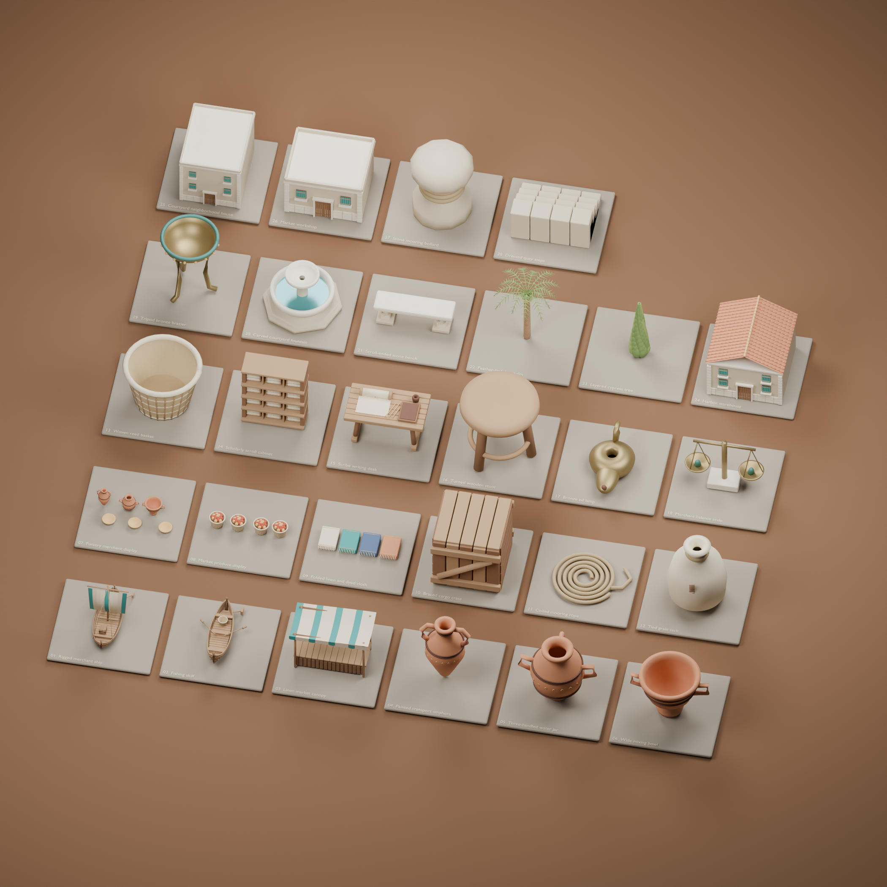
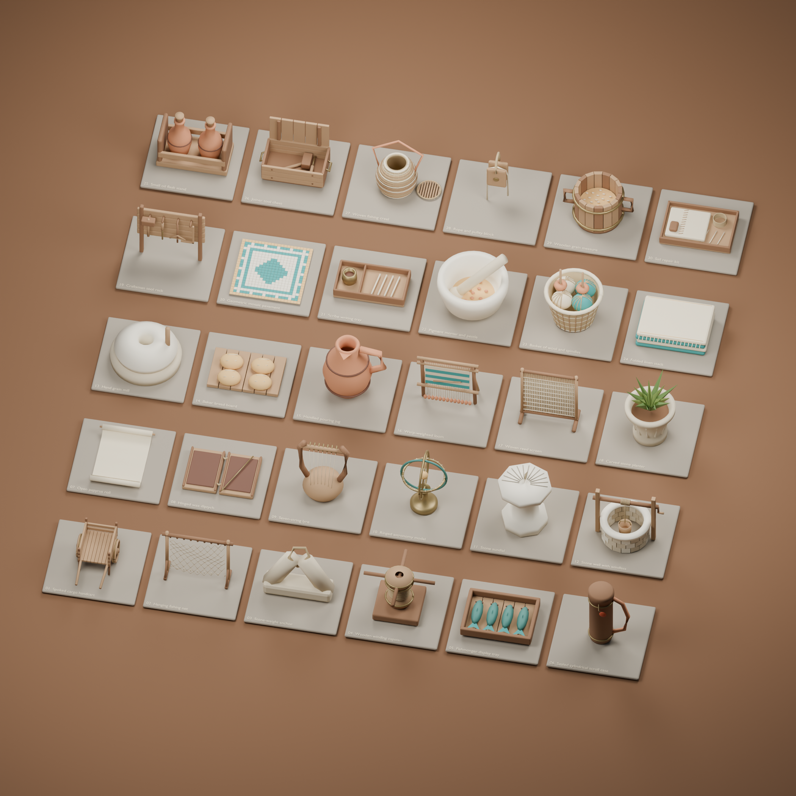

# Alexandria model pack

58 original reusable scenery models across two packs, added September 10, 2026: the original 28-model collection plus a 30-model everyday-detail expansion. The existing library and lighthouse remain in place, giving Alexandria 60 scenery model types from these authored collections, excluding the separately authored characters. Every new model has a scene placement.

These are detailed, stylized Hellenistic-inspired teaching props. They are not scanned artifacts, verified reconstructions, or evidence of ancient economic activity. No external geometry or textures were acquired. The new assets use the repository's MIT license; historical and textual evidence remains in its existing source cards.



## Included models

| Area | Models | Visible detail |
| --- | --- | --- |
| Harbor | Merchant ship, fishing skiff | Curved individual hull strakes, deck boards, raised stems, thwarts, oars, billowing sail panels, standing rigging, sheets, deck cargo |
| Market | Market canopy, pottery display, produce display, textile display | Draped striped linen, scalloped edges, post lashings, counter joinery, stocked baskets, layered fabrics, hems and fringe |
| Pottery | Amphora, hydria, krater | Hollow interiors, turned profiles, handles, painted bands and repeated shoulder decoration |
| Cargo | Cargo crate, rope coil, grain sack, woven basket | Separate planks, braces, nails, continuous coiled rope, gathered sack neck, basket warp and weft |
| Scholarship | Scroll rack, writing desk, wooden stool, oil lamp | Cabinet cubbies, tied papyrus rolls, writing surface, wax tablet, reed pens, ink cup, turned seat, stretchers, bronze reservoir and wick |
| Courtyard | Balance scale, bronze brazier, courtyard fountain, marble bench | Hanging pans and weights, tripod feet, riveted bowl, hollow basins, carved ribs, bench volutes |
| Planting | Date palm, cypress | Ringed trunk, arching ribs, individually folded palm leaflets, date clusters, layered cypress foliage |
| Neighborhood | Harbor warehouse, courtyard house, workshop house | Roof tiles, parapets, masonry courses, corner quoins, shutter boards, door planks and bronze straps |
| Waterfront | Mooring bollard, quay steps | Turned stone caps, wrapped line, individual dressed treads |

## Everyday-detail expansion: 30 more models



| Area | Models | Detail |
| --- | --- | --- |
| Harbor | Cargo handcart, fishing-net rack, stone anchor, capstan, fish tray | Ten-spoke wheels, tire bands, joinery, diamond-mesh net, floats and sinkers, pierced stone, wrapped drum, modeled fish and fins |
| Scholarship | Scroll case, open papyrus, wax diptych, seven-string lyre, armillary model, sundial | Carrying strap, wax seal, curled sheet, cord hinges, stylus, strings and pegs, graduated nested rings, radial dial marks |
| Market and craft | Quern, bread board, pouring jug, weighted loom, reed screen, tool rack | Grinding opening, scored loaves, pouring lip, hanging loom weights, individual reeds, mallet, chisel, bow drill and square |
| Courtyard | Well, stone planter, mosaic pavement | Open masonry shaft, windlass, hanging bucket, fluting, folded leaves and 484 individually modeled tesserae |

The net, handcart, capstan, well, and weaving area have shared placement/collision definitions in `alexandriaDetailLayout.ts`. The actual exported footprints are checked against these bounds. Thin paving and objects on furniture do not add ground obstructions. The detail loader provides visible fallbacks, commits only a complete pack, and disposes late loads. Food on the harbor cart responds to harbor activity; market supplies respond to market activity. Decorative scrolls remain blank; adding a model does not add a new source or activity.

The rings, sundial, tools, and music props are artistic teaching interpretations, not documented artifacts from an identified ancient building. The astronomy model has no astronomical simulation or measurement behavior.

## Files and reuse

- `public/models/alexandria/`: 28 standalone GLBs, the optimized runtime `alexandria-kit.glb`, and `manifest.json`.
- `public/models/alexandria-details/`: 30 standalone GLBs, `alexandria-details.glb`, and its independent manifest.
- `assets/blender/alexandria-details.blend`, `alexandria-details-contact-sheet.png`, and `alexandria-details-validation.json`: expansion source, inspected studio preview, and measured checks.
- `assets/blender/alexandria-kit.blend`: editable source, organized as a labeled studio collection. Individual objects are normalized for the contact sheet in this file; regenerate the GLBs with the script to restore the scene-scale export transforms.
- `assets/blender/alexandria-contact-sheet.png`: rendered and visually inspected collection preview.
- `assets/blender/alexandria-validation.json`: measured per-model geometry, dimensions, file sizes, and integration checks.
- `scripts/blender/build_alexandria_pack.py` and `build_alexandria_details.py`: deterministic pack authorship, using shared geometry/export helpers in `alexandria_geometry.py`, seed 49.
- `components/worlds/scene/alexandriaKit.ts`: registered assets, placement, instancing, activity visibility, loading and cleanup.

The runtime downloads two independent bundles. Standalone exports are available for reuse but are not also fetched by the scene. Models use native glTF metallic/roughness materials and geometry detail, without image textures or a decoder dependency. Coordinates are Blender Z-up and glTF Y-up; facades face Three.js +Z. Model origins are at the base, except boats whose origin is their nominal waterline.

Named anchors are retained: `CargoAnchor`, `Waterline`, `DisplayAnchor`, `ScrollAnchor`, and `DocumentAnchor`. These are attachment points for future authored interactions, not newly enabled evidence or clickable source controls.

## Integration behavior

The existing library, lighthouse and animated archive-door nodes are unchanged. Detailed ships retain their existing bobbing, visibility and scenario behavior. Houses, palms and market stalls retain their existing placement groups. New fountain, bench and bollard collision footprints have visible lightweight fallbacks while the bundle loads or if it fails.

Market displays respond to market activity; harbor cargo responds to harbor activity. This is an illustrative scenario display, not historical data. The whole bundle is validated before replacing placeholders. A failed or incomplete load keeps the original playable scene. Late loads after unmount dispose their resources. Shared geometry is reused for repeated models, and repeated static decorations use instanced draw calls. All learning state and source readers stay outside the asset loader.

## Craft and scholarship continuation

Six further original props are integrated: a compartmented scribe tray with ink and reed pens on the library scroll cabinet; a hollow pigment mortar with resting pestle at the produce stall; a basket of wool and clay-whorl spindles beside the loom; hemmed, fringed linen on the textile counter; a pegged oil-flask carrier on the pottery counter; and a plank tool chest with raised lid, hinges, handles and tools beside the craft rack. They use the existing material palette and the same MIT provenance. No written evidence is fabricated.

All six have runtime placements. Ground props stay within the existing weaving collision envelope. Counter props use the measured top of the actual scaled GLB planks, and raycasts verify support at all four footprint corners. New market supplies follow the existing market-activity visibility; the library and craft tools remain present. The loader requests bundle revision 2 so previously loaded scene assets refresh.

The expanded detail bundle measures **1,899,028 bytes**, an increase of 550,932 bytes, with **60,560 unique triangles**. Every individual detail stays below 500 KB and 10,000 triangles. The legacy initial-pack budget including the three named-character reserve is **14,552,784 bytes**, below its 15 MB target; this excludes the separately added external assets, expanded city and background crowd. This is a download/geometry check, not a browser frame-rate measurement. The 26-model Blender sheet was inspected; loader fallback, late disposal, activity visibility, collision envelopes, supported footprints and the connected main route passed the asset validation script.

## Waterfront continuation

Four further original models join the net-drying area: a hollow woven fishing creel with separate reed lid and strap, a suspended timber/bronze pulley block with reeved line, an open stave grain measure with individual grain, and a sailmaker’s tray with folded canvas, stitched seam, cord and bone needles. Their geometry, materials and Blender source are original MIT-licensed artistic interpretations, not attributed archaeological reconstructions.

The three ground models use the actual .95 m quay height and one small collision envelope; the rigging block hangs from the existing rack’s crossbeam. The grain follows harbor activity while reusable tools remain. The revision-3 bundle is **2,179,952 bytes**, about 281 KB larger than the preceding 26-model pack. All 30 models remain below the per-asset 500 KB/10,000-triangle limits. The older initial-pack-plus-character-reserve budget now totals **14,833,708 bytes**, excluding external assets, city buildings and background crowd. Existing navigation, stock visibility, failed-load fallback and disposal checks remain required.

The inspected placement study shows the pulley loop wrapping the crossbeam and separate ground tools clear of the rack. Reproduce it with `scripts/blender/render_harbor_details.py -- assets/blender/harbor-detail-layout.json`; the validation script exports that JSON directly from runtime coordinates. The output is `assets/blender/harbor-details-placement.png`. Ground-height and pulley-anchor checks pass alongside the existing loader/navigation checks.

## Earlier 20-model checkpoint measurements

- 28 standalone models and the complete bundle parse through the production Three.js GLTFLoader.
- New bundle: **6,158,180 bytes**; detail expansion: **1,348,096 bytes**; both packs with the existing two landmarks: **12,065,488 bytes**, below the documented 15 MB initial model target.
- Original pack after optimization: **213,838 unique triangles**, **111 material mesh primitives**. Expansion: **41,256 unique triangles**. Every expansion object is below 500 KB, 10,000 triangles, and seven material primitives.
- All new placed model copies together: **652,994 triangles**, **334 material draw calls** before view culling. The first pack alone previously used 729,448 placed triangles; simplified basket cross-sections and foliage reduce the expanded collection by about 10.5% in this geometry measure. Draw calls increased with the new objects, so this is not a frame-rate improvement claim. This excludes the existing landmarks, base terrain, water, people, interface and shadow passes; it is not a GPU benchmark.
- Exact exported vertex bounds, coordinate conversion, material type, finite vertices, named anchors, independent activity changes, fallback preservation and late-load cleanup checked by `scripts/check-alexandria-pack.mjs`.
- The original release passed 35 deterministic tests. This expansion passed the 13 navigation/controller tests before the concurrent larger-city rewrite. Combined release checks are coordinated with that scene task.
- Whole-project TypeScript passed at this expansion checkpoint, before the concurrent larger-city rewrite. Final production build and browser checks are coordinated with the task currently enlarging the world and adjusting lighting/water. The prior 28-model integration passed a production build.
- Including a reserve for the separately authored Dorian, Ione, and Thaleia GLBs yields **14,001,852 bytes**, still below 15 MB.
- Blender contact sheet visually inspected. Browser GPU performance and full scene visual QA were not measured in this pass.

## Regenerate and validate

```sh
blender --background --factory-startup --python scripts/blender/build_alexandria_pack.py -- /tmp/alexandria-pack
blender --background --factory-startup --python scripts/blender/build_alexandria_details.py -- /tmp/alexandria-details
```

Review each output contact sheet, then copy its generated `.glb` files and manifest to the corresponding `public/models/alexandria/` or `public/models/alexandria-details/` directory; copy the `.blend` and preview into `assets/blender/`.

```sh
node --import tsx scripts/check-alexandria-pack.mjs
node --import tsx scripts/check-alexandria-details.mjs
node --import tsx --test tests/*.test.ts
npx tsc --noEmit
```

The first command rewrites the validation report with measurements from the actual exported files. Model generation, loading and animation make no paid model API calls.
