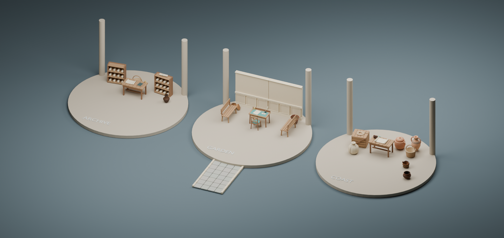
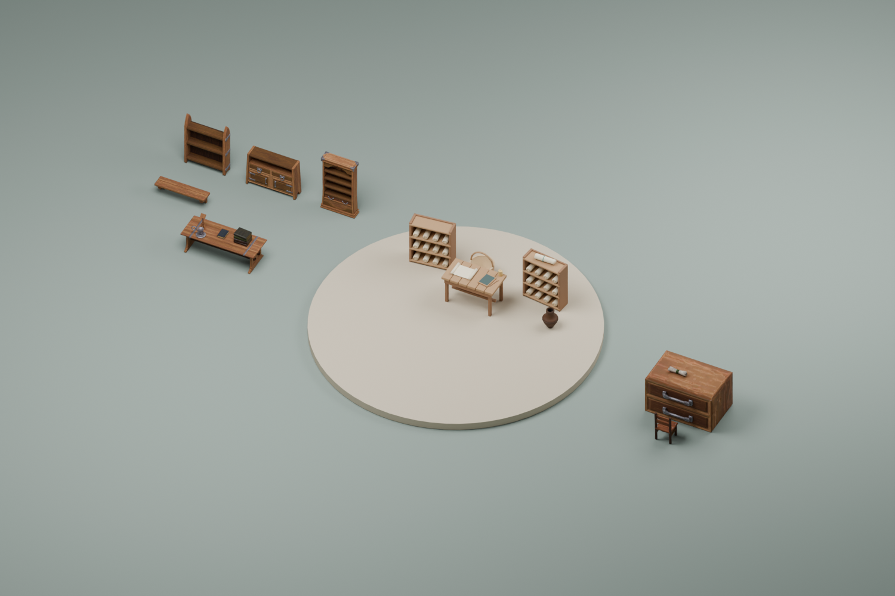
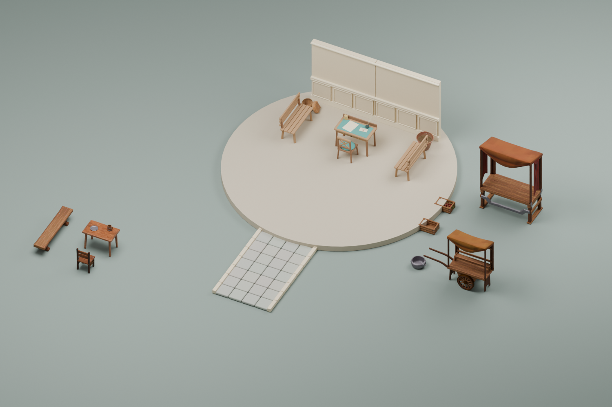
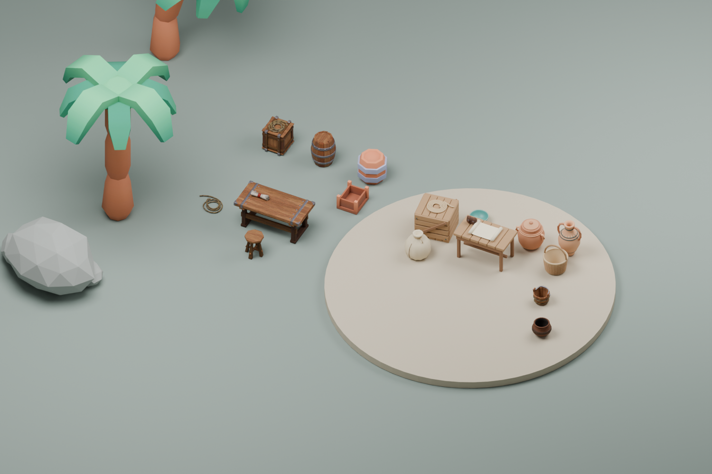

# External model integration

September 10, 2026. The acquired CC0 library now has **69 self-contained local GLBs**, a searchable **`/model-catalog`** route, and a [detailed usage guide for every item](../assets/external/USAGE-GUIDE.md). **47 distinct external models appear in 117 placements across the ten lesson worlds**. Including the three reusable templates, the catalog records 49 models in 201 placements. The latest follow-up below describes the current scene additions and runtime checks.

The catalog provides an actual GLB preview, optional animation playback, downloads, original source links, creators/licenses, measured geometry/file sizes, dimensions, readiness, placement and collision instructions, animation/retargeting notes, current coordinates, code examples and preparation history. It loads one selected model at a time. Model preview does not automatically play animations.

## Initial base-layout inventory

This earlier four-layout inventory is retained to explain the reusable templates. Current per-world counts and payloads are in the [generated usage guide](../assets/external/USAGE-GUIDE.md).

| Setting | External additions | Placements | Unique GLB transfer |
| --- | --- | ---: | ---: |
| Alexandria | Scroll, pouch, two pottery forms, bag, quay rope and paddle | 7 | 1,026,416 bytes |
| Coast | Workbench and tools, cargo, offshore rocks/rowboats and 22 palms replacing procedural trees | 47 | 5,066,440 bytes |
| Garden | Candles, planters, baskets, produce, stalls/cart, and a tea table with seating | 19 | 3,034,500 bytes |
| Archive | Candles/pottery plus reading tables, shelving, cabinet, books, a comparison desk and chair | 18 | 2,793,756 bytes |

These are external additions only, deduplicated per scene. They exclude authored models, JavaScript, metadata and decoded textures/GPU allocations. The full published library is 30,054,608 bytes; its static subset is 11,194,272 bytes. The two animation reference GLBs account for most of the remaining transfer and are never requested by a classroom scene.

The authored furniture, scrolls, letters, teaching characters, landmarks, cave, sheep and ships remain in place. External props supplement those objects. Coordinates account for the actual inset writing surface rather than the desk's higher back gallery. Tabletop overlaps found during review were removed; new coast vessels stand beside the station rather than intersecting its scroll.

Classroom loading only accepts `scene-eligible` IDs from a local generated index. Eight assemblies or context-sensitive pieces and twelve character/accessory/animation references remain blocked. All forty-nine eligible static objects are now placed. Eight assembly/context items and twelve character/accessory/animation references remain unplaced. Eligibility is not a claim of historical authenticity or device performance.

## Expanded activity areas

The archive now has a separate reading table with books, a bookstand and candlestick, rear storage and shelving, and a comparison desk with a scroll and chair. The garden has a market display, a cart, and a tea table with a mug, plate and nearby seats. The coast has a workbench, stool, scroll, cargo and ropes; 22 Kenney palms replace the simple procedural trees. Palm blockers conservatively cover the low bent trunk rather than the full canopy.

The tea table uses uniform scale 0.5 for a 0.775 m tabletop; its collision bounds use the same scale. Supported items explicitly name their table or crate. Tests raycast those actual meshes to check surface heights and verify that items stay within their support footprints. The rope uses scale 0.65 to fit inside the crate rim.

Literary themes can filter placements: for example, the garden market/tea cluster appears in Austen and custom garden settings, rather than every document lesson. The catalog lists the four base layouts; themed lessons may use a subset.

## Runtime behavior

- `components/worlds/scene/externalLayout.ts` owns explicit placements. Lesson-generated text cannot specify arbitrary models or remote URLs.
- `externalModels.ts` owns a scene-local cache with at most three requests in flight. Repeated objects share their static geometry and materials. Failed requests keep bounded box fallbacks.
- Source-station tags use the existing `onSelect` callback. Props never collect evidence, award credit or manufacture historical facts. Characters keep their existing talk callbacks.
- Solid ground additions join the existing generated-setting navigation, including the same blockers while models load or fail. Small tabletop objects inherit their furniture's blocker. Alexandria additions sit on existing furniture or quay edges; future ground obstacles need its separate navigation registry updated.
- Cleanup removes the external root and releases unique geometry, materials, textures and decoded ImageBitmaps. Queued loads resolve to null on teardown; late completions release resources instead of appearing in a disposed scene.
- Each scene includes a compact art-credit notice separating illustrative art from primary evidence.

## Stored records and reproduction

- [Acquisition and individual usage records](../assets/external/catalog.json): creator/source/license evidence, original paths, ZIP fingerprints, source dependencies and adaptations.
- [Published catalog](../assets/external/runtime-catalog.json): stable IDs, local URLs, dimensions, measured bytes/geometry, clips, preparation and SHA-256. A public copy supports the catalog route.
- [Actual placements](../assets/external/placements.json) and [scene payloads](../assets/external/scene-budgets.json): generated from application placement code.
- [Per-item usage guide](../assets/external/USAGE-GUIDE.md): every item, including those held for future reuse.
- [Original acquisition QA](../assets/external/MODEL-QA.md): source preservation and twelve original sample renders; these are separate from the newer normalized runtime exports.

```sh
# Re-export intentional derivative changes from retained sources (Blender 4.5).
blender --background --factory-startup --python scripts/blender/export_external_library.py

# Verify outputs and regenerate public metadata, runtime index and all item instructions.
node --import tsx scripts/catalog-external-models.ts

# Test cache lifecycle, selection restrictions, payload bounds and reachable stations.
node --import tsx --test tests/externalModels.test.ts

# Optional combined studio study of authored and external station props.
node --import tsx scripts/export-setting-layout.mjs
blender --background --factory-startup --python scripts/blender/render_external_integration.py
```

The exporter records new hashes; the catalog generator rejects unexpected byte changes. Public static exports use a centered, grounded meter contract and inspection/label anchors. Original rigged files retain canonical transforms; both animation GLBs are exact source copies. Retargeting, independent skeleton cloning, historical costume and classroom character acceptance remain future adaptation work.

## Verification and limits

All 69 published GLBs passed checksum/length, embedded-dependency and real Three.js geometry parsing checks. Static files also matched their recorded dimensions, grounded/centered origins and required anchors. Geometry parsing omits browser image decoding; it does not claim a complete Khronos validator or pixel-level texture QA for every asset.

Fourteen targeted external-model tests pass, covering deduplication, concurrency, failure continuation, disposal, late completions, readiness restrictions, accidental skinned results, payload limits, clear station spawns/approaches, connected activity areas, support surfaces, low palm trunks, scaled footprints and complete use of all eligible models. The previous integration checkpoint passed 80 full-suite tests. The expansion passed 21 combined external/authored integration tests, scoped TypeScript checking, all 69 published-GLB checks, and the Sites production build. These scoped checks avoid conflating unrelated in-progress application edits with this asset change. The build reports the existing large-chunk advisory; it is not a runtime performance measurement.

The combined Blender cutaway below was rendered and inspected using actual application placements and GLBs. It confirms representative station texture loading and relative placement. Roofs and front columns are omitted for visibility. It is **an offline studio render, not a browser screenshot**; it does not show every Alexandria/offshore addition. Browser interaction, device frame times and draw calls have not been measured in this task. Deployment remains with the coordinating application release.



## Expanded-area studies

These additional offline studies use the actual final GLBs and placement transforms. They show the archive reading/comparison area, garden tea/market area, and coastal work area. The views omit pavilion roofs, companions and atmosphere to expose object placement; they are not browser screenshots.







Reproduce with `blender --background --factory-startup --python scripts/blender/render_external_activity_areas.py` after generating the placement JSON.

## Compatibility with the human-scale scene pass

The Alexandria scroll follows `LIBRARY_DESK_Y`; its pouch sits on the exposed wood corner using the same `HUMAN_SCALE.deskVertical`. Market vessels and the bag use `MARKET_COUNTER_Y`. The vessels moved to the left ends of their counters to clear the authored balance scales. A regression raycasts the actual scaled Alexandria kit and checks the vessel/bag footprints against those scales. This follow-up depends on the committed `humanScale.ts` from `1e60897`, but still has no dependency on the theme modules. All fourteen external tests pass after the correction.

## Catalog integration workflow

The catalog now verifies fetched metadata against the bundled runtime registry and requests fresh metadata rather than using a stale cached copy. It offers setting/readiness/category filters, name or file-size sorting, an explicit empty state, and retry on incomplete or mismatched records. The selected detail always belongs to the current results.

The preview and integration panel sit together. Pick a current placement, then copy valid JSON or a scene-setup function with cleanup. Tabletop copies include their supporting external table/crate and preserve its scale. Current coordinates assume the named base layout; when making another instance, update keys, support references and placement together. Existing scenes already attach this art, so the setup example is for a new scene.

Individual assets have shareable `?asset=` links. On narrow screens, choosing an item brings its detail into view. The viewer provides Fit and keyboard-accessible zoom buttons, and pausing an animation preserves its playback position. Full placement tables, deeper loading notes and provenance remain available in expandable sections. Four catalog checks cover registry freshness, combined filters, copyable support bundles and setup-code parsing/cleanup.

## Follow-up — actual lesson scenes and supported reading details

The catalog now indexes the same resolved placements that the ten lesson worlds load, rather than treating the four base layouts as the current lesson scenes. It distinguishes 112 external placements in ten worlds from 84 placements in three reusable templates (196 cataloged placements in total). Scene filters, asset links with `?asset=…&scene=…`, per-item placement lists, setup examples, and lesson links follow that distinction. The generated usage guide and payload report include every world and template. These counts cover external art only; the separately authored Alexandria and setting kits remain outside this catalog.

Eighteen new placements reuse the existing CC0 book, book-stack and candlestick GLBs on six existing furniture supports:

| World | Existing support | Added objects | Opens source station |
| --- | --- | --- | --- |
| Frankenstein | Study cabinet | Book, book stack, candlestick | Library |
| A Christmas Carol | Counting-house cabinet | Book, book stack, candlestick | Harbor |
| Declaration | Left and right comparison tables | Three objects per table | Library |
| Douglass: literacy | Courtyard work desk | Book, book stack, candlestick | Library |
| Seneca Falls | Meeting desk | Book, book stack, candlestick | Library |

`themeExternalDetails.ts` places each item relative to its final, already translated furniture transform. Measured top heights are 0.62826 m for the large table, 1.14553 m for the drawer workbench and 1.09861 m for the cabinet, before support scaling. The helper preserves the small objects' scale, adds a 3 mm surface clearance, inherits support rotation, and leaves ground collision with the existing furniture. Every item references its supporting entry, so the catalog can copy both together. Do not translate these resolved coordinates a second time.

The scene review found that the retained library already covers these reading-room gaps. No new asset download or license dependency was needed. Existing authored ships, cave, sheep, joinery, writing desks, letters and quill/inkwell already provide the major scene-specific objects. Character bases and unassembled ship parts remain adaptation references; the new work does not silently promote them into classroom use. The book art is illustrative, contains no new teaching evidence, and does not claim an authenticated edition or historically reconstructed furnishing.

Validation: all 69 published GLBs passed checksum, embedded-dependency, geometry and origin checks. The 25 focused checks passed, including all themed arrivals and source-stop routes, exact catalog/runtime placement agreement, supported copies, parsed setup code, and actual-mesh raycasts for all 18 new objects. Their footprints fit the supports and do not overlap. Browser visual review and classroom-device performance remain unverified.

## Follow-up — additional scene props and runtime loading verification

Five more placements now appear through the existing lesson renderer:

- **A Christmas Carol:** a market stall and apple crate at `[12, 0, -15]`, outside the source apron. The produce sits on the measured 0.88818 m counter with a 3 mm clearance; the canopy height is not used as a tabletop height. Both objects open the market source station.
- **The Tempest:** a small interpreted camp pot at `[17, 0, 5]`, connected to the market source station. It is optional scene dressing and makes no claim about a specific object in the text.
- **Frankenstein:** a low study shelf at `[-7, 0, -14]` and a supported book at 0.394 m, both connected to the library source station.

The new `themeExternalActivityAreas.ts` entries join `themedExternalPlacements`, which `GeneratedWorldScene` already passes to `loadExternalModels`. Solid objects therefore enter the same navigation registry before vegetation is placed. No second model layer, duplicate renderer hook, or scene-specific fetch path was added. The catalog now reflects **47 distinct external models in 117 lesson placements**; including reusable templates, it records **49 models in 201 placements**. The two palm variants remain template-only because the themed landscape already provides its own vegetation.

`loadExternalModels` now exposes `ready` and per-asset `status` (`loading`, `ready`, `failed`, `disposed`) for integration checks, and accepts the same optional fetch-adapter pattern as the authored loader. Normal renderers continue to use its local allowlisted GLB URLs. Empty GLB scenes retain their source-selectable fallback. Scene disposal clears the detached object hierarchy, and models completing after disposal cannot reattach.

Runtime verification loads the actual local GLB geometry for every lesson world, confirms placeholder replacement and placement transforms, raycasts the new source links and supporting surfaces, verifies one request per unique asset, and checks shared-resource disposal. Separate failure/empty/late-completion cases preserve source access and prevent reattachment. These tests exclude browser texture decoding and WebGL appearance. The combined 41 focused tests pass, including navigation with the current vegetation and architecture. All 69 catalog GLBs were revalidated; the regenerated per-item guide and budgets match the scene registry.
