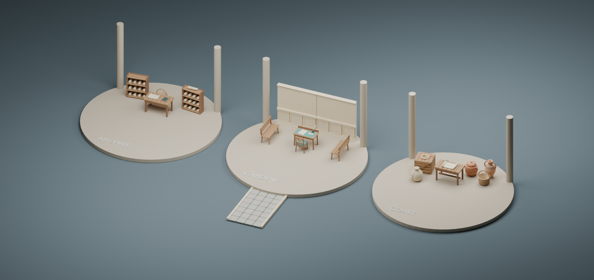

# Models in the archive, garden and coast settings

The generated lesson renderer now places 24 existing original model types in 96
locations. This extends the previously integrated Alexandria kits into the other
three symbolic settings. These are interpretive props, not new primary sources or
claims that a complete historical/literary location has been reconstructed.

| Setting | Distinct models | Placements | Model downloads |
| --- | ---: | ---: | ---: |
| Archive | 6 | 21 | 650,412 bytes |
| Garden | 8 | 30 | 1,189,040 bytes |
| Coast | 13 | 45 | 1,973,120 bytes |

Shared assets count once in the total of 24 types. Downloads exclude the app,
renderer and other scene geometry. Only the selected setting's assets load, with
at most four requests in flight. Repeated placements share geometry/materials.
URLs are selected from a fixed local registry and versioned by manifest checksum.

The archive has reading tables, paired scroll racks, open/rolled scrolls, wax
tablets and baskets. The garden has writing desks, chairs, open/sealed letters,
quills and inkwells, benches, paneled walls and stone paving. The coast has reading
tables and scrolls, stacked cargo, pottery, baskets, rope, sacks, two offshore
ships, coastal rocks, three sheep and a walk-through cave.

## Behavior

- Overview hides pavilion roofs to show the furnished reading stations. Walk mode
  restores the roofs; the same models and collision map remain in place.
- Furniture, rock, tree, column and character footprints stop the walking camera.
  Station arrivals and routes remain open. The cave has a conservative clear
  passage under its curved roof; both ends connect to the island's floor.
- Walk height follows the station platforms, plaza, connecting paths and garden
  paving. Movement is subdivided to prevent stepping through furniture.
- Each asset keeps its own visible fallback until its replacements are ready.
  A missing model does not remove other props or change collision boundaries.
  Cave and ship fallbacks preserve recognizable openings and silhouettes.
- Teardown removes the model group before the renderer's scene cleanup, disposes
  each shared source once, and releases late-arriving loads without reattaching.
- Letters, scrolls and wax tablets open their assigned station's evidence through
  the existing lesson reader, before and after their detailed models load. They
  contain no invented quotations or embedded source IDs. Character identities,
  labels, conversation buttons, evidence markers and keyboard inspection remain
  available. The nearest visible surface wins a click, so walls and furniture
  block objects behind them. Marker rotation respects reduced motion.

## Verification

`node --import tsx --test tests/setting-models.test.ts` passes eight targeted tests:
all 24 GLBs parse with the real Three.js loader and match manifest checksums,
bounds and anchors; all stations and arrival points connect to the central plaza;
movement cannot tunnel through objects or leave the island; the cave clears the
camera at eye height; repeated models share resources; partial failures retain
fallbacks; teardown and late loads release resources.

Scoped TypeScript checking covers the renderer and its new modules. ESLint passes
for the new modules, test and layout exporter. The combined production build and
live browser rehearsal belong to the coordinating scene task; this checkpoint
does not claim browser performance or native literary-scene acceptance.

The combined local integration also passes the external-loader checks and the
scene-selection tests: 19 tests across `setting-models.test.ts`,
`externalModels.test.ts`, and `scenePicking.test.ts`. The common hit resolver
preserves external prop inspection and named-character conversation actions.
An optional HTTP checksum check against the running preview was blocked by the
approval service's account usage limit; live-server delivery remains unverified
by this task. The real local GLBs, their checksum/bounds contracts and application
type checking are verified independently.

## Placement preview

This Blender studio cutaway uses the real runtime placements and GLBs. Pavilion
roofs/front columns are omitted to expose the furniture; station labels are added
for the study. It is not a screenshot of the application. Offshore ships and the
outer cave/rock/sheep placements are outside this station-only view.



Reproduce the study:

```sh
node --import tsx scripts/export-setting-layout.mjs
blender --background --python scripts/blender/render_setting_stations.py
```

Runtime: `components/worlds/GeneratedWorldScene.tsx`,
`components/worlds/scene/settingLayout.ts`, and
`components/worlds/scene/settingAssets.ts`. Asset sources, rights and inspect
anchors remain in [the model kit](../assets/MODEL-KIT.md) and
[its manifest](../assets/model-manifest.json).
